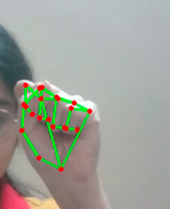
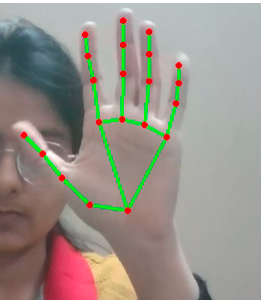
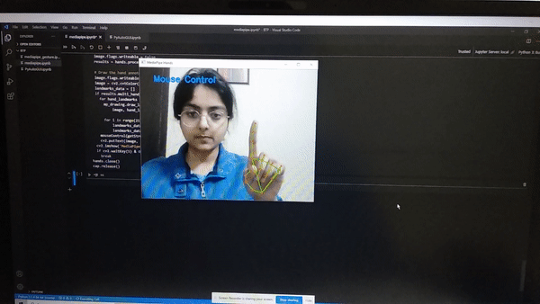
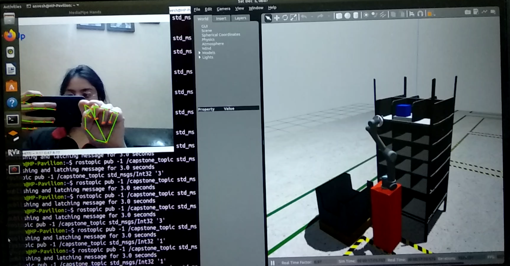
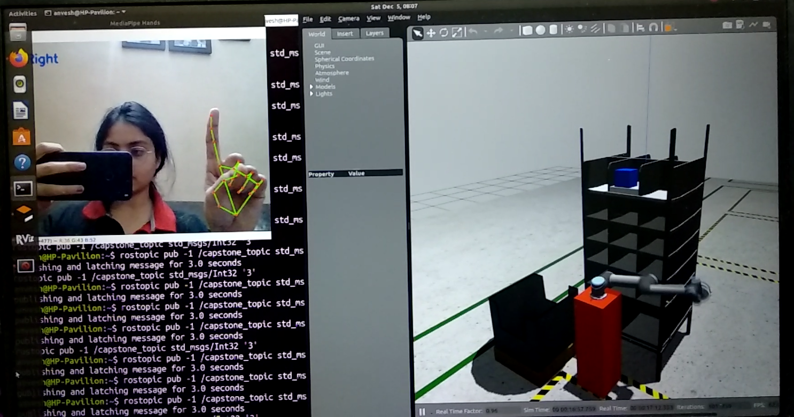

# GESTURE RECOGNITION FOR HMI

## Abstract
Hand gesture recognition is one of the most important technologies employed in computer and human interaction. This plays an even important role in surgical processes, where steps are taken to prevent spreading of infection. For example, doctors have a display in front of them, which aids during surgery by showing the 3d models of body parts, MRI images and so on. The display is used to rotate, zoom in and do other functions to the scans. Similarly, for many electronic equipment, controlling them by gestures is of great interest in the surgical rooms as this reduces the time of surgery.

The complete project includes the following steps:
1. Building of deep learning model to recognize hands
2. Using another model to locate hand landmarks and return the coordinates of all the
landmarks
3. Use these detected landmarks to identify different gestures
4. Integrate these gestures with computer to control various interfaces
Two interfaces have been controlled in our project
1. Our computer screen: Gestures were used to control mouse pointer, keyboard and other
movements like zoom in/out, swipe, etc
2. Robotic arm: Movement of a simulated robotic arm was controlled using the gestures
The end goal of our project is to make an efficient model that is able to detect these gestures with
high accuracy.

## Methodology

Modelling of the complete project can be divided into three parts:
1. DL modelling for gesture recognition
2. Computer screen interface control
3. Robotic arm control

We have first detected palms using the BlazePalm model. We applied non-max suppression method to get the final bounding box around the palm. Cross entropy loss is used to train the model. After detecting the palm, the hand segmentation is done to increase accuracy of hand landmark detecting models. After segmenting, we train the model to detect the landmarks.

These landmarks are further used to map to predefined gestures. These gestures are subsequently used to control the computer interface using the PyAutoGUI library. The result obtained are as per the expectations.

Gestures are also used to control the robotic arm’s end effector. The arm has been simulated using ROS, Gazebo and Rviz

## Results

### Detecting hand landmarks

### Controlling computer screen with detected hand landmark

 

### Controlling simulated robotic arm with detected hand landmarks

Here the detected gesture has been mapped to home position. The robotic arm is therefores going to its home position

 

Here the detected gesture has been mapped to right position. So the robotic arm is turning to right

 
